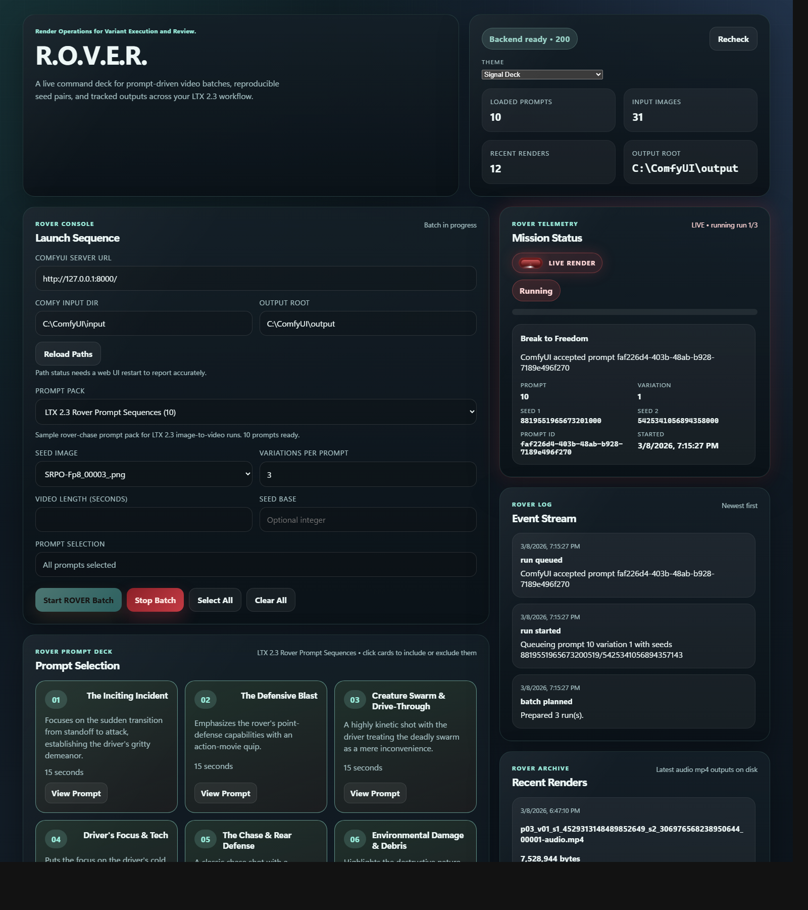

# R.O.V.E.R.

`R.O.V.E.R.` stands for `Render Operations for Variant Execution and Review`.

This project wraps a ComfyUI LTX 2.3 image-to-video workflow with:

- a local web UI for batch control
- YAML prompt packs
- repeatable two-seed render planning
- organized output folders
- prompt sidecar files for every rendered video

The goal is simple: start from one seed image, run multiple prompts and multiple seeded variations, and keep the results traceable.

## Quick Start

1. Install latest ComfyUI and start it.
2. Install Python 3.10+ and run:

```powershell
python -m pip install -r .\requirements.txt
```

3. Install the required custom nodes listed below.
4. Download the required model files listed below into the correct ComfyUI model folders.
5. Start the local UI:

```powershell
.\run_rover_web_ui.ps1 -ComfyUrl http://127.0.0.1:8000/
```

6. Open `http://127.0.0.1:8765`
7. Set `Comfy Input Dir` and `Output Root` if your ComfyUI install is not under `C:\ComfyUI`
8. Add a seed image to your ComfyUI input folder
9. Set the video length in seconds if you want to override the workflow default
10. Select a prompt pack and run a batch

## Screenshots



## What This Project Does

R.O.V.E.R. takes:

- one ComfyUI API workflow template
- one selected seed image from your ComfyUI input directory
- one selected prompt pack from `prompt-packs/`
- a variation count per prompt

It then:

1. generates explicit `seed_1` and `seed_2` values for each variation
2. patches the ComfyUI API workflow in memory
3. submits runs to the ComfyUI HTTP API
4. waits for render completion
5. writes outputs under:
   `OutputRoot\LTX2.3\PromptIteration\<prompt #>\`
6. writes a `.txt` sidecar next to each video with the exact prompt and seeds used

## Architecture

The system has four layers:

1. Prompt packs
   Stored as YAML files in `prompt-packs/`.

2. R.O.V.E.R. execution core
   `ltx23_batch_core.py` parses prompt packs, builds render plans, assigns seeds, patches the workflow, queues jobs, and writes sidecars.

3. Interfaces
   - `ltx23_web_ui.py` provides the local browser UI and JSON API.
   - `ltx23_batch_runner.py` provides the CLI entrypoint.

4. ComfyUI
   ComfyUI executes the patched API workflow and writes the actual media outputs.

High-level flow:

```text
prompt-packs/*.yaml
        |
        v
R.O.V.E.R. Web UI / CLI
        |
        v
ltx23_batch_core.py
        |
        v
workflows/ltx23_rover_api.json
        |
        v
ComfyUI API (/prompt, /history)
        |
        v
OutputRoot/LTX2.3/PromptIteration/<prompt#>/
```

## Repository Layout

```text
prompt-packs/
  rover-prompt-pack.yaml
  _prompt_pack.template.yaml

docs/
  screenshots/
    rover-tall-v2.png

webui/
  index.html
  app.js
  styles.css

workflows/
  ltx23_rover_api.json
  ltx23_rover_ui.json

ltx23_batch_core.py
ltx23_batch_runner.py
ltx23_web_ui.py
requirements.txt
run_rover_batch.ps1
run_rover_web_ui.ps1
README.md
```

## Workflow Files

Both workflow files are kept on purpose:

- `workflows/ltx23_rover_api.json`
  Required. This is the execution template R.O.V.E.R. patches and submits to ComfyUI.

- `workflows/ltx23_rover_ui.json`
  Optional for runtime, useful for editing in the ComfyUI editor. If you change the graph in ComfyUI, export a fresh API JSON again so the runtime template stays in sync.

## Requirements

Assumptions for this project:

- latest ComfyUI is already installed
- Python 3.10 or newer is available on the machine running R.O.V.E.R.
- `PyYAML` is installed for prompt-pack parsing
- ComfyUI API access is available
- FFmpeg support is available for `comfyui-videohelpersuite` video output

Common ComfyUI API URLs:

- ComfyUI Desktop often uses `http://127.0.0.1:8000/`
- standalone/portable ComfyUI often uses `http://127.0.0.1:8188/`

## Known-Good Download Links

Good as of `March 8, 2026`.

These links matched:

- the current workflow in `workflows/ltx23_rover_api.json`
- the filenames currently referenced by the active loader nodes
- a working local setup used to validate this project

Upstream repos and filenames can change. If a link goes stale later, verify the filename against the workflow before downloading a replacement.

### Core

- ComfyUI:
  `https://github.com/Comfy-Org/ComfyUI`
- ComfyUI-Manager:
  `https://github.com/Comfy-Org/ComfyUI-Manager`

### Custom Nodes

- ComfyUI-LTXVideo:
  `https://github.com/Lightricks/ComfyUI-LTXVideo`
- ComfyUI-KJNodes:
  `https://github.com/kijai/ComfyUI-KJNodes`
- ComfyUI-VideoHelperSuite:
  `https://github.com/Kosinkadink/ComfyUI-VideoHelperSuite`
- ComfyUI-GGUF:
  `https://github.com/city96/ComfyUI-GGUF`
- rgthree-comfy:
  `https://github.com/rgthree/rgthree-comfy`

### Active Model File Pages

- Main UNet:
  `https://huggingface.co/unsloth/LTX-2.3-GGUF/blob/main/ltx-2.3-22b-dev-Q8_0.gguf`
- Text encoder 1:
  `https://huggingface.co/unsloth/gemma-3-12b-it-GGUF/blob/main/gemma-3-12b-it-UD-Q4_K_XL.gguf`
- Text encoder 2:
  `https://huggingface.co/unsloth/LTX-2.3-GGUF/blob/main/text_encoders/ltx-2.3-22b-dev_embeddings_connectors.safetensors`
- Video VAE:
  `https://huggingface.co/Kijai/LTX2.3_comfy/blob/main/vae/LTX23_video_vae_bf16.safetensors`
- Audio VAE:
  `https://huggingface.co/Kijai/LTX2.3_comfy/blob/main/vae/LTX23_audio_vae_bf16.safetensors`
- Spatial upscaler:
  `https://huggingface.co/Lightricks/LTX-2.3/blob/main/ltx-2.3-spatial-upscaler-x2-1.0.safetensors`
- LoRA:
  `https://huggingface.co/Lightricks/LTX-2.3/blob/main/ltx-2.3-22b-distilled-lora-384.safetensors`

## Required Custom Nodes

This workflow uses non-core nodes. If ComfyUI reports missing classes, install these extensions first:

- `ComfyUI-LTXVideo`
  Provides the LTX video/audio workflow nodes such as `LTXVConditioning`, `LTXVImgToVideoInplace`, `LTXVAudioVAEDecode`, `LTXVLatentUpsampler`, `LTXVScheduler`, and `LTXVPreprocess`.

- `ComfyUI-KJNodes`
  Provides `SimpleCalculatorKJ`, `ImageResizeKJv2`, `VAELoaderKJ`, `LTX2_NAG`, and `LTX2SamplingPreviewOverride`.

- `comfyui-videohelpersuite`
  Provides `VHS_VideoCombine`.

- `ComfyUI-GGUF`
  Provides `UnetLoaderGGUF` and `DualCLIPLoaderGGUF`.

- `rgthree-comfy`
  Provides `Power Lora Loader (rgthree)`.

Recommended install path:

1. Install `ComfyUI-Manager`.
2. Use it to install the custom node packs above.
3. Restart ComfyUI.

## Required Models

The active execution path in `workflows/ltx23_rover_api.json` uses the following model files.

### Active Models

| Purpose | Loader | Filename | Tested folder |
|---|---|---|---|
| Main UNet | `UnetLoaderGGUF` | `ltx-2.3-22b-dev-Q8_0.gguf` | `ComfyUI\models\unet\` |
| Text encoder 1 | `DualCLIPLoaderGGUF` | `gemma-3-12b-it-UD-Q4_K_XL.gguf` | `ComfyUI\models\text_encoders\` |
| Text encoder 2 | `DualCLIPLoaderGGUF` | `ltx-2.3-22b-dev_embeddings_connectors.safetensors` | `ComfyUI\models\text_encoders\` |
| Video VAE | `VAELoader` | `LTX23_video_vae_bf16.safetensors` | `ComfyUI\models\vae\` |
| Audio VAE | `VAELoaderKJ` | `LTX23_audio_vae_bf16.safetensors` | `ComfyUI\models\vae\` |
| Spatial upscaler | `LatentUpscaleModelLoader` | `ltx-2.3-spatial-upscaler-x2-1.0.safetensors` | `ComfyUI\models\latent_upscale_models\` |
| LoRA | `LoraLoaderModelOnly` | `ltx-2.3-22b-distilled-lora-384.safetensors` | `ComfyUI\models\loras\` |

### Inactive Alternate Loaders Present In The Workflow

These nodes exist in the saved workflow, but they are not part of the active execution path used by R.O.V.E.R. today:

- `UNETLoader` for `LTXVideo\v2\ltx-2.3-22b-distilled_transformer_only_fp8_scaled.safetensors`
- `DualCLIPLoader` for:
  - `gemma_3_12B_it_fpmixed.safetensors`
  - `ltx-2.3_text_projection_bf16.safetensors`

You do not need those alternate files unless you intentionally rewire the workflow to use that branch.

## Model Setup Guidance

R.O.V.E.R. does not download models for you. Users need to:

1. install the required custom node packs
2. download the model files named above
3. place them in the correct ComfyUI model folders
4. restart ComfyUI
5. open the workflow in ComfyUI and confirm all loader dropdowns resolve correctly

If a model does not appear in a loader dropdown:

- the file is in the wrong folder
- the filename does not match
- the required custom node pack is missing
- ComfyUI needs a restart

## Python Setup

R.O.V.E.R. uses the Python standard library plus one external package:

- `PyYAML`

Recommended setup:

```powershell
python -m venv .venv
.\.venv\Scripts\Activate.ps1
python -m pip install --upgrade pip
python -m pip install -r .\requirements.txt
```

If you do not want a virtual environment, this also works:

```powershell
python -m pip install -r .\requirements.txt
```

## Prompt Packs

Prompt packs are YAML files stored in `prompt-packs/`.

R.O.V.E.R. auto-discovers:

- `prompt-packs/*.yaml`
- `prompt-packs/*.yml`

Files beginning with `_` or `.` are ignored, which is why the template file does not appear in the UI.

Starter template:

- `prompt-packs/_prompt_pack.template.yaml`

Example structure:

```yaml
format: rover_prompt_pack_v1
name: Example Prompt Pack
description: Shown in the prompt-pack selector.

prompts:
  - number: 1
    title: Example Prompt
    concept: Short summary shown on the placard.
    duration: 15 seconds
    beats:
      - timestamp: 0-5s
        description: First beat.
      - timestamp: 5-10s
        description: Second beat.
    extras:
      - Optional extra line.
    speech_sound: >
      Optional dialogue and sound notes.
```

## Output Structure

Rendered videos are organized like this:

```text
OutputRoot/
  LTX2.3/
    PromptIteration/
      1/
        p01_v01_s1_<seed1>_s2_<seed2>_00001-audio.mp4
        p01_v01_s1_<seed1>_s2_<seed2>_00001-audio.txt
      2/
      3/
```

The `.txt` sidecar records:

- prompt number
- prompt title
- variation
- image name
- seed 1
- seed 2
- video length in seconds
- filename prefix
- positive prompt text
- negative prompt text

## Running The Web UI

Preferred launcher:

```powershell
.\run_rover_web_ui.ps1 -ComfyUrl http://127.0.0.1:8000/
```

Optional startup overrides:

```powershell
.\run_rover_web_ui.ps1 `
  -ComfyUrl http://127.0.0.1:8000/ `
  -ComfyInputDir D:\ComfyUI\input `
  -OutputRoot D:\ComfyUI\output
```

Default web UI URL:

```text
http://127.0.0.1:8765
```

### Web UI Notes

- `Comfy Input Dir` controls the seed image dropdown.
- `Output Root` controls the archive panel and where R.O.V.E.R. expects final output files.
- `Video Length (Seconds)` overrides the workflow's default render length for the whole batch.
- Those path fields can be changed live in the page.
- The browser stores those values in local storage.
- Use `Reload Paths` after changing them.

## Running The CLI

Preferred launcher:

```powershell
.\run_rover_batch.ps1 --server-url http://127.0.0.1:8000/ --image my_seed.png --prompt-numbers 1-3 --variations 3 --video-length-seconds 12
```

Other examples:

```powershell
.\run_rover_batch.ps1 --dry-run --dry-run-dir .\dry-run
```

```powershell
.\run_rover_batch.ps1 --seed-base 12345 --variations 3
```

```powershell
.\run_rover_batch.ps1 --prompts .\prompt-packs\rover-prompt-pack.yaml --prompt-numbers 1-3
```

## Reproducibility

Each render variation gets:

- `seed_1`
- `seed_2`

R.O.V.E.R. stores those in the filename and in the prompt sidecar. If you reuse the same prompt pack, workflow template, image, and seeds, you have the best chance of reproducing the same result later.

## Configuration Notes

- The web UI is local-only and binds to `127.0.0.1` by default.
- The current web launcher and entrypoints use `python -B`.
- The Python entrypoints also set `sys.dont_write_bytecode = True`.
- `.gitignore` ignores `__pycache__/`, local venvs, and scratch files.

## Troubleshooting

### The prompt cards load but image dropdown is empty

Usually means the `Comfy Input Dir` is wrong or the folder does not contain supported image files.

### Recent renders panel is empty

Usually means:

- the `Output Root` is wrong
- no render has been written yet under `OutputRoot\LTX2.3\PromptIteration\`
- you need to click `Reload Paths`

### The page says a path is not found even though it exists

Restart the R.O.V.E.R. backend and hard refresh the page. This usually happens when the browser is running newer frontend code against an older backend process.

### ComfyUI is installed somewhere other than `C:\ComfyUI`

That is supported. Set:

- `ComfyUI Server URL`
- `Comfy Input Dir`
- `Output Root`

either in the web UI or in the launcher arguments.

### ComfyUI rejects the workflow with missing nodes

Install the required custom node packs listed above and restart ComfyUI.

### ComfyUI loads the workflow but model dropdowns are missing entries

The model files are not in the correct ComfyUI model folders, or ComfyUI needs a restart.

### API runs fail while the workflow seems to animate in the desktop UI

That is normal behavior. The ComfyUI backend queue is shared between the UI and API. R.O.V.E.R. submits API jobs to the same backend the desktop app is displaying.

## GitHub Publish Notes

This repository is ready to publish, but two final housekeeping choices are still yours:

- add a `LICENSE` file that matches how you want others to use the project
- optionally add screenshots or a short demo clip to the README

For end users cloning the repo, the shortest accurate onboarding message is:

1. Install latest ComfyUI.
2. Install Python and `pip install -r requirements.txt`.
3. Install the required custom node packs.
4. Download the required model files into the correct ComfyUI model folders.
5. Start ComfyUI.
6. Start `run_rover_web_ui.ps1`.
7. Set your ComfyUI URL, input directory, and output root in the page if they differ from the defaults.
8. Add a seed image to your ComfyUI input folder.
9. Select a prompt pack and run a batch.
